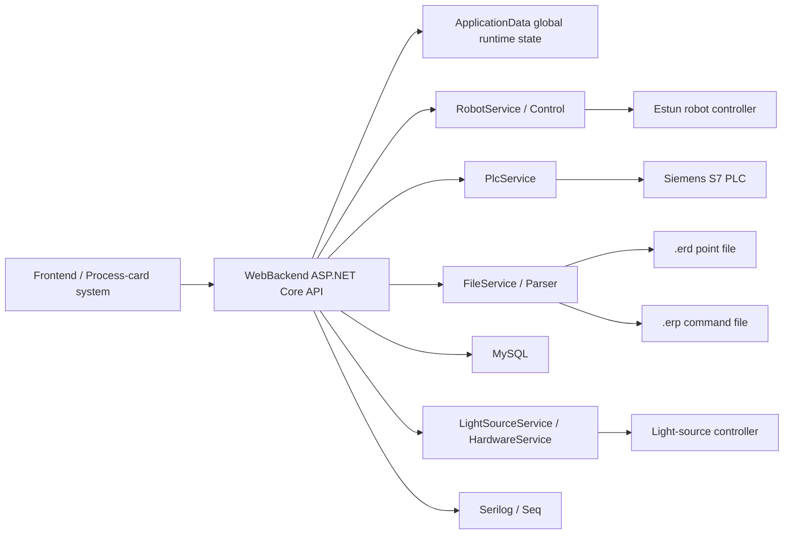

# Console_Robot Robot Arm Control Backend Handover Guide

[中文](README.md) | [English](README.en.md)

This project is the backend control program for a robot-arm inspection station. Its core responsibility is to connect the frontend/process-card system, Estun robot, PLC, light-source controller, MySQL database, and camera trigger workflow. You can first understand it as an ASP.NET Core Web API project: HTTP endpoints receive commands, while the Service layer talks to hardware, databases, and trajectory files.

## Current Project Status

- Main program: `WebBackend`
- Tech stack: C# / ASP.NET Core / .NET 8 / Windows
- Robot: Estun robot API, see `WebBackend/EstunRemoteApiLib-V1.3`
- PLC: Siemens S7, using `S7.Net`
- Database: MySQL
- Logging: Serilog local file logs + Seq
- Trajectory files: `.erd` stores points, `.erp` stores motion commands
- Main runtime system: Windows, recommended with Visual Studio 2022 or the `dotnet` CLI

> Important: this program controls real robot-arm and field equipment. Any automatic-process change must be tested at low speed, dry-run first, and supervised on site. Confirm the coordinate system, tool ID, PLC signals, and emergency-stop status before running with a real workpiece.

## Repository Structure

```text
Console_Robot/
├─ DevelopRobot.sln                 # Visual Studio solution
├─ WebBackend/
│  ├─ Program.cs                     # ASP.NET Core startup, dependency injection, logging, hosted services
│  ├─ WebBackend.csproj              # .NET 8 project file and hardware DLL references
│  ├─ config.yaml                    # PLC, robot, process-card backend, Seq, trajectory dictionary config
│  ├─ appsettings.json               # MySQL connection strings and ASP.NET configuration
│  ├─ Controller/                    # HTTP API controllers
│  ├─ Service/                       # Core business logic and hardware communication
│  ├─ Dao/                           # Data models, database entities, global state
│  ├─ DTO/                           # Frontend/backend transfer objects
│  ├─ Util/                          # Robot control wrapper, ERP/ERD parser
│  ├─ data/                          # Local trajectory files and system.erd
│  └─ EstunRemoteApiLib-V1.3/        # Estun robot SDK and dependency libraries
├─ docs/                             # DocFX documentation source
├─ api/                              # DocFX-generated API metadata
└─ _site/                            # DocFX static site output
```

## System Diagram



## First Run

### 1. Environment Preparation

Recommended environment:

- Windows
- Visual Studio 2022
- .NET 8 SDK
- MySQL, reachable through the database configured in `appsettings.json`
- Seq, optional, for structured log viewing
- RabbitMQ, optional; the current code registers a local RabbitMQ connection, but the main workflow may not use it every time
- Field network access to the robot, PLC, light-source controller, and process-card backend
- Estun robot SDK dependency DLLs can be loaded correctly
- Light-source controller DLLs: `BXSoft_Dll`, `BX_SetIPParm_Dll`, `BX_struct`, `SNDeviceDLL`

If compilation fails because `BXSoft_Dll`, `BX_struct`, or similar DLLs cannot be found, first check the `HintPath` entries in `WebBackend/WebBackend.csproj`. These references currently point to an external SDK directory on the original machine and may not migrate completely with the repository.

### 2. Configuration Check

Before running, focus on two files:

- `WebBackend/config.yaml`
- `WebBackend/appsettings.json`

Important settings in `config.yaml`:

| Setting | Purpose |
| --- | --- |
| `PlcSettings:CpuType` | PLC CPU type, for example `S71500` |
| `PlcSettings:IpAddress` | PLC IP address |
| `DataDirectory` | Local trajectory-file directory, default `.\data` |
| `RobotConfiguration:Ip` | Robot controller IP |
| `RobotConfiguration:GlobalSpeed` | Global speed set during startup |
| `RobotConfiguration:UserId` | User coordinate-system ID |
| `RobotConfiguration:ToolId` | Tool coordinate-system ID |
| `ProductCardBackend` | Process-card backend address, used to download remote `.erd/.erp` files |
| `SeqDatabaseSettings` | Seq log server and API keys |
| `TraceTypeDict` | Mapping between trajectory-type abbreviations and Chinese meanings |

`appsettings.json` mainly contains MySQL connection strings:

- `ConnectionStrings:MySqlConnection`
- `ConnectionStrings:ErrorLogs`

Do not commit production passwords, GitHub Tokens, or real secrets to a public repository. It is recommended to create an `appsettings.example.json`; real configuration should stay on the local machine or in the internal deployment environment.

### 3. Start the Backend

Start from the project directory so `config.yaml` can be found:

```powershell
cd D:\Console_Robot\WebBackend
dotnet restore
dotnet run
```

You can also open `DevelopRobot.sln` in Visual Studio and start `WebBackend`.

Swagger is enabled in the development environment. After startup, check the listening address printed in the console. It is usually available at:

```text
http://localhost:5000/swagger
```

### 4. Basic Startup Sequence

For field commissioning, use this order:

1. Confirm the robot, PLC, light source, database, and process-card backend are reachable in the same network.
2. Start `WebBackend`.
3. Call `POST /Robot/connect` to connect to the robot.
4. Call `POST /Robot/startup` to initialize the robot: clear errors, enable servo, set speed, load the user coordinate system and tool coordinate system, and switch to API mode.
5. Use `GET /Robot/servo`, `GET /Point/wpos`, and `GET /Point/jpos` to check status.
6. Test one short trajectory at low speed before running semi-automatic or automatic workflows.

## Core Modules

### `Program.cs`

Startup entry. It mainly:

- Loads `config.yaml` and `appsettings.json`
- Registers Swagger
- Registers MySQL, Seq, and Serilog
- Registers all Controllers, Services, and hosted services
- Registers CORS
- Starts hosted background tasks:
  - `DatabaseInitializer`
  - `AutoOrManDetectService`
  - `TaskProcessingService`
  - `ThreadMonitoringService`

### `RobotService`

Robot business layer. It wraps the main motion-control logic and depends on `WebBackend.Util.Control` to call the Estun low-level API.

Main capabilities:

- `Startup()`: initialize the robot, clear errors, enable servo, set speed, load coordinate system and tool
- `Connect()` / `Disconnect()`: connect to or disconnect from the robot controller
- `Start()` / `Pause()` / `Stop()` / `ContinueMove()`: control the motion queue
- `RunCommand()` / `RunCommandAsync()`: execute a single `.erp` command
- `RunAllCommand()` / `RunAllCommandAsync()`: execute the currently loaded trajectory
- `GetCurrentJPos()` / `GetCurrentWPos()`: read current joint coordinates and world coordinates
- `SetGlobalSpeed()` / `GetGlobalSpeed()`: set or read global speed

Currently supported motion commands:

- `MovJ`
- `MovL`
- `MovC`

When a point has `det=1`, the program treats it as an inspection point: after the robot reaches the point, it triggers the PLC camera signal. `det=2` is mainly used for end-point logic such as waiting for motion completion and reset.

### `Control`

Location: `WebBackend/Util/Control.cs`

This is a second-level wrapper around the Estun SDK. Avoid calling the SDK directly from Controllers. Common wrappers include:

- Connecting to the controller
- Acquiring/releasing control permission
- Setting servo state
- Setting global speed
- Loading user coordinate systems and tool coordinate systems
- Linear, joint, and circular movement
- Reading current coordinates and robot status

### `PlcService`

Location: `WebBackend/Service/PLCService.cs`

Responsible for communicating with the Siemens PLC through `S7.Net`.

Main capabilities:

- Connect to PLC
- Read/write bits in DB blocks
- Read/write `WorkOrderNumber`
- Read/write `PartDetails`
- Read `PartName`
- Trigger the camera signal through `TakePhoto()`

Common signals are currently hard-coded, especially in `AutoOrManDetectService`. Examples:

| Signal | Code address |
| --- | --- |
| Site 1 inspection ready | `DB6.DBX98.2` |
| Site 1 robot inside inspection area | `DB6.DBX98.3` |
| Site 1 robot outside area | `DB6.DBX98.4` |
| Site 1 quality recheck | `DB6.DBX98.7` |
| Site 2 inspection ready | `DB6.DBX99.1` |
| Site 2 robot inside inspection area | `DB6.DBX99.2` |
| Site 2 robot outside area | `DB6.DBX99.3` |
| Site 2 quality recheck | `DB6.DBX99.6` |

If the PLC point table changes, update `AutoOrManDetectService` and `PlcService` first. Do not only change the frontend.

### `FileService` and `Parser`

Locations:

- `WebBackend/Service/FileService.cs`
- `WebBackend/Util/Parser.cs`

They load trajectory files into memory:

- `.erd`: points, coordinates, `det` marker, optional `lightTime`
- `.erp`: robot motion commands
- `system.erd`: speed `Vxx` and zone `Cxx`

During startup, `ApplicationData` parses `ZoneDict` and `SpeedDict` from `DataDirectory/system.erd`. Before executing a trajectory, `FileService.LoadData()` loads the specified `.erd/.erp` files and writes:

- `ApplicationData.PosDict`
- `ApplicationData.CommandList`
- `ApplicationData.PointsToBeDetected`

### `ApplicationData`

Location: `WebBackend/Dao/IApplicationData.cs`

This singleton global-state object stores the current runtime state. Common fields include:

- Current process-card ID, workpiece ID, and work-order number
- Current mode
- Current trajectory name, trajectory type, and inspection position
- Current trajectory index, point index, and photo index
- Loaded points, commands, speeds, and zones
- Trajectory list passed from the frontend for semi-automatic workflow

Note: because it is a singleton, multiple requests and background threads may read/write it. Be careful with concurrency and state reset when modifying automatic workflows.

### `AutoOrManDetectService`

Main automatic-mode workflow. It inherits from `BackgroundService` and keeps polling after the program starts.

Approximate flow:

1. Check whether the current mode is automatic.
2. Initialize and reset PLC signals.
3. Check whether the robot is ready.
4. Write the Site 1 inspection-ready signal.
5. Wait for the conveyor/PLC to report Site 1 arrival.
6. Read work-order number and part information from PLC.
7. Find the process-card ID by work-order number or `PartName`.
8. Get trajectory paths from the database/process card.
9. Execute vertical-inspection trajectories.
10. Write recheck/pass/Site 2 ready signals based on inspection result.
11. After Site 2 arrival, execute oblique-inspection trajectories.
12. Reset state after completion and wait for the next workpiece.

This is the most important on-site workflow code. Before changing it, draw the PLC timing sequence first.

### `SemiAutoService`

Main semi-automatic workflow.

The usual entry point is `POST /api/NewProcessCard/upload`. After the frontend sends a process card and trajectory list, the program:

1. Saves process-card information to `ApplicationData`
2. Records `BeginTime`
3. Starts the semi-automatic inspection workflow in the background
4. Runs `VerticalInspection()` first, then `ObliqueInspection()`
5. Downloads each remote `.erd/.erp` file to the local `data` directory
6. Parses the files and calls `RobotService.RunAllCommandAsync()`
7. Resets `BeginTime` after the workflow ends

### `TaskProcessingService`

Hosted task-queue service, mainly used by flows such as `POST /Robot/run`, where a task is created manually, queued, and executed.

It loops over the queue:

- If there is a task: load `.erd/.erp`, execute trajectory, update task state in the database
- If the queue is empty: wait for 1 second

Emergency stop and continue logic are also here:

- `EmergencyStop()`
- `TaskContinue()`

### Light-source Services

Two classes are involved:

- `LightSourceService`
- `HardwareService`

The current code connects to the light-source controller at `192.168.1.10:10000` by default. `RobotService.RunCommandAsync()` adjusts light-source current according to the point's `lightTime`, then triggers camera capture at inspection points.

If the light-source controller IP, port, or channel meaning changes, check:

- `LightSourceService`
- `LightController`
- `LightSourceControllers`
- `lightTime` in `.erd` point files

## Main APIs

Only common endpoints are listed below. For the full list, see Swagger or `WebBackend/Controller`.

| Method | Path | Purpose |
| --- | --- | --- |
| `POST` | `/Robot/connect` | Connect to robot |
| `POST` | `/Robot/startup` | Initialize robot |
| `POST` | `/Robot/start` | Start motion |
| `POST` | `/Robot/pause` | Pause motion |
| `POST` | `/Robot/stop` | Stop motion |
| `POST` | `/Robot/disconnect` | Disconnect robot |
| `GET` | `/Robot/servo` | Check servo status |
| `POST` | `/Robot/global-speed` | Set global speed |
| `GET` | `/Robot/global-speed` | Read global speed |
| `POST` | `/Robot/run` | Create and execute trajectory tasks by process-card ID |
| `GET` | `/Robot/emergency-stop` | Emergency-stop current task |
| `GET` | `/Robot/continue` | Continue after emergency stop |
| `GET` | `/Point/wpos` | Current world coordinates |
| `GET` | `/Point/jpos` | Current joint coordinates |
| `GET` | `/Point/count` | Current loaded point count |
| `POST` | `/Point/tool-id` | Set tool ID |
| `GET` | `/Plc/test-connection` | Test PLC connection |
| `GET` | `/Plc/take-photo` | Trigger camera signal |
| `POST` | `/api/NewProcessCard/upload` | Upload process card and start semi-automatic inspection |
| `GET` | `/Mode` | View current work mode |
| `GET` | `/api/v1/robot/Manual/save-point-info` | Save current point |
| `GET` | `/api/v1/robot/Manual/download-point-info` | Download manually saved points |

Many endpoints use the response format from `DTO/R.cs`:

```json
{
  "data": {},
  "code": 200
}
```

## Trajectory Files

### `.erp`

`.erp` files are motion-command lists. Common format:

```text
MovJ{P=t_l.J0,V=t_s.V100,B="RELATIVE",C=t_s.C0}
MovL{P=t_l.P0,V=t_s.V100,B="RELATIVE",C=t_s.C10}
MovC{A=t_l.P4,P=t_l.P5,V=t_s.V100,B="RELATIVE",C=t_s.C10}
```

`Parser.ParseCommand()` parses each line into a `Command`, then `RobotService.RunCommand()` executes the corresponding motion based on `Type`.

### `.erd`

`.erd` files store points, for example:

```text
P3={_type="CPOS",...,x=36.655,y=-503.996,z=1165.553,a=90.653,b=-0.053,c=-90,...,det=1}
```

Key fields:

- `P3`: point name, must match `P=t_l.P3` in `.erp`
- `x/y/z/a/b/c`: spatial position and orientation
- `a7` to `a16`: external-axis or extended-axis fields
- `det=0`: normal transition point
- `det=1`: inspection point; triggers camera capture after arrival
- `det=2`: wait-completion/end-point logic
- `lightTime`: current code uses it as the light-source current value; default is `2` when missing

### `system.erd`

`system.erd` defines speeds and zones, for example:

```text
C10={_type="ZONE",per=10.000000,dis=10.000000,vConst=0}
V100={_type="SPEED",per=10.000000,tcp=100.000000,ori=360.000000,exj_l=360.0000000,exj_r=180.000000}
```

If `.erp` uses `V200` or `C20`, the corresponding item must be parsable in `system.erd`.

## Database

The code mainly uses these concepts:

- `process_cards`: process-card table
- `trace_paths` or a similar trajectory-path table: finds `.erd/.erp` by process card
- `task`: task execution records
- `trace_type`: trajectory type, inspection position, and version
- `total_tasks` / `sub_tasks`: total tasks and subtasks
- Error-log database: pointed to by the `ErrorLogs` connection string

Important services:

- `ProcessCardService`: find process-card ID by work-order number or part name
- `TraceService`: query trajectory paths by process-card ID
- `TaskService`: create, update, delete, and query tasks and trajectory types; set picture directory
- `TotalTasksService` / `SubTasksService`: task statistics and decomposition

If the database schema changes after handover, check the SQL in these Services first.

## Logging

Local log paths:

```text
WebBackend/logs/debug/debug.log
WebBackend/logs/info/info.log
WebBackend/logs/error/error.log
```

Seq logging is controlled by `SeqDatabaseSettings` in `config.yaml`. The code writes Controller logs and non-Controller logs using two separate API keys.

When debugging on site, check in this order:

1. Console output
2. `logs/error/error.log`
3. Seq
4. PLC signal state
5. Robot-controller alarm information

## Files to Read First

Recommended reading order:

1. `WebBackend/Program.cs`: how the project starts and which services are registered
2. `WebBackend/config.yaml`: field IPs, speed, tool ID, coordinate system
3. `WebBackend/Service/RobotService.cs`: how the robot executes trajectories
4. `WebBackend/Util/Control.cs`: Estun API wrapper
5. `WebBackend/Service/PLCService.cs`: PLC read/write and work-order parsing
6. `WebBackend/Service/AutoOrManDetectService.cs`: automatic inspection workflow
7. `WebBackend/Service/SemiAutoService.cs`: semi-automatic inspection workflow
8. `WebBackend/Service/FileService.cs` and `WebBackend/Util/Parser.cs`: trajectory-file loading
9. `WebBackend/Dao/IApplicationData.cs`: global runtime state
10. `WebBackend/Controller/RobotController.cs`: robot-related HTTP entry points

## Common Modification Points

### Change Robot IP, Speed, or Tool ID

Edit `WebBackend/config.yaml`:

```yaml
RobotConfiguration:
  Ip: "Robot IP"
  AutoReconnect: true
  GlobalSpeed: 30
  UserId: 1
  ToolId: 9
```

### Change PLC Address

Edit `WebBackend/config.yaml`:

```yaml
PlcSettings:
  CpuType: "S71500"
  IpAddress: "PLC IP"
```

### Change Process-card Backend Address

Edit `WebBackend/config.yaml`:

```yaml
ProductCardBackend:
  Ip: "Backend IP"
  Port: "Port"
  Base: "/api/v1/vt-process-card-software"
```

### Add a New Motion Command

In general, update:

1. `Parser.ParseCommand()` to confirm new command parameters can be parsed
2. `RobotService.RunCommand()` / `RunCommandAsync()` to add a command branch
3. `Control.cs` to wrap the low-level SDK call
4. Use a small `.erp/.erd` file for dry-run verification first

### Change PLC Timing

Start with:

- `AutoOrManDetectService.ExecuteAsync()`
- `HandleSite1InspectionStartAuto()`
- `HandleSite2InspectionStartAuto()`
- `InitializeAndResetSignals()`
- `PlcService.ReadBit()` / `WriteBit()`

Whenever a bit is changed, update this README or attach a PLC point table.

## Safety and Maintenance Notes

- Do not commit GitHub Tokens, database passwords, Seq API keys, robot-controller passwords, or other real secrets to a public repository.
- Before connecting to the real robot arm, confirm emergency stop, speed, tool coordinates, user coordinates, and workpiece space.
- The default global speed comes from `config.yaml`; use low speed during field debugging.
- Back up `.erd/.erp` files before changing trajectories.
- `ApplicationData` is a singleton. Automatic, semi-automatic, and manual interfaces may all modify it, so consider thread safety when changing state fields.
- `AutoOrManDetectService` is a background polling service. It runs without manual endpoint invocation.
- Some historical Chinese comments in the code may have encoding issues. It is recommended to save files uniformly as UTF-8 in future maintenance.
- `WebBackend/Program1.cs` appears to be an old test entry point, not the current main entry point. The current entry point is `Program.cs`.

## Troubleshooting

### Startup Reports Missing `config.yaml`

Start from the `WebBackend` directory:

```powershell
cd D:\Console_Robot\WebBackend
dotnet run
```

The code uses `Directory.GetCurrentDirectory()` as the configuration root.

### Compilation Reports Missing Light-source Controller DLLs

Check these references in `WebBackend/WebBackend.csproj`:

- `BXSoft_Dll`
- `BX_SetIPParm_Dll`
- `BX_struct`
- `SNDeviceDLL`

Place the vendor SDK in a fixed directory, or change references to an in-project `libs/` path.

### Compilation or Runtime Reports Estun DLL Load Failure

Confirm these files can be copied to the output directory:

```text
WebBackend/EstunRemoteApiLib-V1.3/x64/bin/
```

If the target machine lacks the VC++ Runtime, DLL loading may also fail.

### Robot Connection Fails

Check:

- `RobotConfiguration:Ip`
- Whether the computer and robot are on the same subnet
- Whether the robot controller allows API connections
- Whether the teach pendant or another program already occupies control permission
- Whether the robot has uncleared alarms

### PLC Read/Write Fails

Check:

- `PlcSettings:IpAddress`
- Whether the PLC model matches `CpuType`
- Whether the DB block allows external access
- Whether rack/slot are correct; the current constructor defaults to `rack=0, slot=0`
- Whether the field point table matches the DB addresses in code

### Trajectory Runs But No Photo Is Taken

Check:

- Whether the corresponding `.erd` point has `det=1`
- Whether `.erp` actually passes through that point
- `PlcService.TakePhoto()` writes to `DB1.DBX2.1`
- Whether the camera/light-source trigger wiring is connected to the corresponding PLC output

### No Motion After Uploading a Process Card in Semi-automatic Mode

Check:

- Whether `traces` in the `POST /api/NewProcessCard/upload` request body is empty
- Whether `erd_file_path` / `erp_file_path` can be combined with `ProductCardBackend` into downloadable URLs
- Whether the local `data` directory is writable
- Whether `SemiAutoService` logs show download or parse failures

### Automatic Mode Keeps Waiting

Check:

- Whether `ApplicationData.ModeState.CurrentMode` is `Automatic`
- Whether the PLC bit that `AutoOrManDetectService` is waiting for actually changes
- Whether Site 1/Site 2 arrival signals match the code point table
- Whether the work-order number and `PartName` can find a process card

## Version-control Suggestions

- Do not test temporary field code directly on the main branch.
- Commit PLC point changes, coordinate-system changes, tool-ID changes, and automatic-process changes separately.
- Write commit messages that explain the field symptom and the reason for the change.
- Decide later whether large generated directories such as `_site/` and `api/` should continue to be committed.
- Real configuration should be turned into template files; field configuration should not enter the repository.

