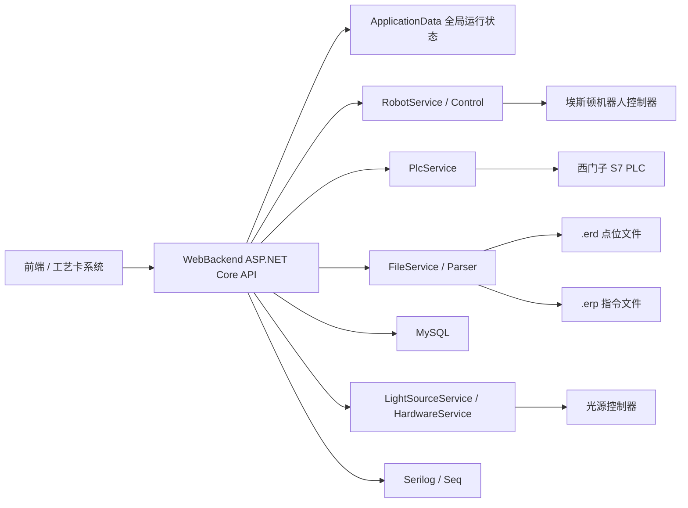

# ESTUN机械臂控制后端说明文档

[中文](README.md) | [English](README.en.md)

这个项目是机械臂检测工位的后端控制程序，核心作用是把前端/工艺卡系统、埃斯顿机器人、PLC、光源控制器、MySQL 数据库和拍照触发流程串起来。可以先把它当成一个 ASP.NET Core Web API 项目理解：HTTP 接口负责接收指令，Service 层负责真正和硬件、数据库、轨迹文件打交道。

## 项目当前状态

- 主程序：`WebBackend`
- 技术栈：C# / ASP.NET Core / .NET 8 / Windows
- 机器人：埃斯顿机器人 API，见 `WebBackend/EstunRemoteApiLib-V1.3`
- PLC：西门子 S7，使用 `S7.Net`
- 数据库：MySQL
- 日志：Serilog 本地文件日志 + Seq
- 轨迹文件：`.erd` 存点位，`.erp` 存运动指令
- 主要运行系统：Windows，建议用 Visual Studio 2022 或 `dotnet` 命令行

> 重要：这套程序会真实控制机械臂和现场设备。任何自动流程改动都要先低速、空跑、有人看护，确认坐标系、工具号、PLC 信号和急停状态后再跑工件。

## 仓库结构

```text
Console_Robot/
├─ DevelopRobot.sln                 # Visual Studio 解决方案
├─ WebBackend/
│  ├─ Program.cs                     # ASP.NET Core 启动入口、依赖注入、日志、后台服务注册
│  ├─ WebBackend.csproj              # .NET 8 项目文件和硬件 DLL 引用
│  ├─ config.yaml                    # PLC、机器人、工艺卡后端、Seq、轨迹字典等配置
│  ├─ appsettings.json               # MySQL 连接串等 ASP.NET 配置
│  ├─ Controller/                    # HTTP API 控制器
│  ├─ Service/                       # 核心业务逻辑和硬件通信
│  ├─ Dao/                           # 数据模型、数据库实体、全局状态
│  ├─ DTO/                           # 前后端传输对象
│  ├─ Util/                          # 机器人控制封装、ERP/ERD 解析器
│  ├─ data/                          # 本地轨迹文件和 system.erd
│  └─ EstunRemoteApiLib-V1.3/        # 埃斯顿机器人 SDK 及依赖库
├─ docs/                             # DocFX 文档源
├─ api/                              # DocFX 生成的 API 元数据
└─ _site/                            # DocFX 静态站点输出
```

## 系统关系图



## 第一次运行

### 1. 环境准备

建议环境：

- Windows
- Visual Studio 2022
- .NET 8 SDK
- MySQL，可连到 `appsettings.json` 中配置的数据库
- Seq，可选，用来查看结构化日志
- RabbitMQ，可选，当前代码注册了本地 RabbitMQ 连接，但主流程不一定每次都会用到
- 现场网络能访问机器人、PLC、光源控制器和工艺卡后端
- 埃斯顿机器人 SDK 依赖 DLL 可正常加载
- 光源控制器相关 DLL：`BXSoft_Dll`、`BX_SetIPParm_Dll`、`BX_struct`、`SNDeviceDLL`

如果编译时报找不到 `BXSoft_Dll`、`BX_struct` 等，请先检查 `WebBackend/WebBackend.csproj` 里的 `HintPath`。这几项目前指向本机外部 SDK 目录，不一定随仓库完整迁移。

### 2. 配置检查

运行前重点看两个文件：

- `WebBackend/config.yaml`
- `WebBackend/appsettings.json`

`config.yaml` 中最重要的配置：

| 配置 | 作用 |
| --- | --- |
| `PlcSettings:CpuType` | PLC CPU 类型，例如 `S71500` |
| `PlcSettings:IpAddress` | PLC IP |
| `DataDirectory` | 本地轨迹文件目录，默认 `.\data` |
| `RobotConfiguration:Ip` | 机器人控制器 IP |
| `RobotConfiguration:GlobalSpeed` | 启动时设置的全局速度 |
| `RobotConfiguration:UserId` | 用户坐标系 ID |
| `RobotConfiguration:ToolId` | 工具坐标系 ID |
| `ProductCardBackend` | 工艺卡后端地址，用于下载远程 `.erd/.erp` |
| `SeqDatabaseSettings` | Seq 日志服务器和 API Key |
| `TraceTypeDict` | 轨迹类型缩写和中文含义的映射 |

`appsettings.json` 中主要是 MySQL 连接串：

- `ConnectionStrings:MySqlConnection`
- `ConnectionStrings:ErrorLogs`

不要把生产密码、GitHub Token 或真实密钥写进公共仓库。建议另建 `appsettings.example.json`，真实配置只放本机或内网部署环境。

### 3. 启动后端

推荐从项目目录启动，避免 `config.yaml` 找不到：

```powershell
cd D:\Console_Robot\WebBackend
dotnet restore
dotnet run
```

也可以用 Visual Studio 打开 `DevelopRobot.sln`，选择 `WebBackend` 启动。

开发环境下会启用 Swagger，启动后看控制台输出的监听地址，通常可访问：

```text
http://localhost:5000/swagger
```

### 4. 基本启动顺序

现场联调建议按这个顺序来：

1. 确认机器人、PLC、光源、数据库、工艺卡后端都在同一网络内可访问。
2. 启动 `WebBackend`。
3. 调 `POST /Robot/connect` 连接机器人。
4. 调 `POST /Robot/startup` 初始化机器人：清错、上使能、设置速度、加载用户坐标系和工具坐标系、切 API 模式。
5. 用 `GET /Robot/servo`、`GET /Point/wpos`、`GET /Point/jpos` 看状态。
6. 先低速测试单条轨迹，再跑半自动/自动流程。

## 核心模块说明

### `Program.cs`

启动入口，主要做这些事：

- 加载 `config.yaml` 和 `appsettings.json`
- 注册 Swagger
- 注册 MySQL、Seq、Serilog
- 注册所有 Controller、Service 和后台服务
- 注册 CORS
- 启动后台任务：
  - `DatabaseInitializer`
  - `AutoOrManDetectService`
  - `TaskProcessingService`
  - `ThreadMonitoringService`

### `RobotService`

机器人业务层，封装了主要运动控制逻辑。它依赖 `WebBackend.Util.Control` 调用埃斯顿底层 API。

主要能力：

- `Startup()`：初始化机器人、清错、上使能、设置速度、加载坐标系和工具
- `Connect()` / `Disconnect()`：连接或断开机器人控制器
- `Start()` / `Pause()` / `Stop()` / `ContinueMove()`：控制运动队列
- `RunCommand()` / `RunCommandAsync()`：执行单条 `.erp` 指令
- `RunAllCommand()` / `RunAllCommandAsync()`：执行当前加载的整条轨迹
- `GetCurrentJPos()` / `GetCurrentWPos()`：读取当前关节坐标和世界坐标
- `SetGlobalSpeed()` / `GetGlobalSpeed()`：设置或读取全局速度

运动指令目前主要支持：

- `MovJ`
- `MovL`
- `MovC`

当点位 `det=1` 时，程序会认为这是检测点：机器人运动到位后触发 PLC 拍照信号。`det=2` 主要用于等待运动完成、复位一类的末端点位逻辑。

### `Control`

位置：`WebBackend/Util/Control.cs`

这是埃斯顿 SDK 的二次封装，尽量不要在 Controller 里直接调用 SDK。常用封装包括：

- 连接控制器
- 获取/释放控制权
- 设置伺服
- 设置全局速度
- 加载用户坐标系和工具坐标系
- 直线、关节、圆弧运动
- 读取当前坐标和机器人状态

### `PlcService`

位置：`WebBackend/Service/PLCService.cs`

负责和西门子 PLC 通信，使用 `S7.Net`。

主要能力：

- 连接 PLC
- 读写 DB 块里的 bit
- 读写工作令号 `WorkOrderNumber`
- 读写工件详情 `PartDetails`
- 读取 `PartName`
- 触发拍照信号 `TakePhoto()`

常用信号目前写在代码里，尤其是 `AutoOrManDetectService`。例如：

| 信号 | 代码位置 |
| --- | --- |
| 一号位检测就绪 | `DB6.DBX98.2` |
| 一号位机器人在检测区 | `DB6.DBX98.3` |
| 一号位机器人在区外 | `DB6.DBX98.4` |
| 一号位质量复检 | `DB6.DBX98.7` |
| 二号位检测就绪 | `DB6.DBX99.1` |
| 二号位机器人在检测区 | `DB6.DBX99.2` |
| 二号位机器人在区外 | `DB6.DBX99.3` |
| 二号位质量复检 | `DB6.DBX99.6` |

如果 PLC 点表改了，优先改 `AutoOrManDetectService` 和 `PlcService`，不要只改前端。

### `FileService` 和 `Parser`

位置：

- `WebBackend/Service/FileService.cs`
- `WebBackend/Util/Parser.cs`

它们负责把轨迹文件加载进内存：

- `.erd`：点位、坐标、`det` 标记、可选 `lightTime`
- `.erp`：机器人运动指令
- `system.erd`：速度 `Vxx` 和平滑区 `Cxx`

程序启动时，`ApplicationData` 会从 `DataDirectory/system.erd` 解析 `ZoneDict` 和 `SpeedDict`。执行轨迹前，`FileService.LoadData()` 会加载指定 `.erd/.erp` 并写入：

- `ApplicationData.PosDict`
- `ApplicationData.CommandList`
- `ApplicationData.PointsToBeDetected`

### `ApplicationData`

位置：`WebBackend/Dao/IApplicationData.cs`

这是单例全局状态对象，负责保存当前运行状态。常见字段：

- 当前工艺卡 ID、工件 ID、工作令号
- 当前模式
- 当前轨迹名称、轨迹类型、检测位置
- 当前执行到第几个轨迹、第几个点、第几张照片
- 已加载的点位、指令、速度、平滑区
- 半自动流程从前端传来的轨迹列表

注意：因为它是单例，多个请求/后台线程都会读写它。改自动流程时要特别注意并发和状态重置。

### `AutoOrManDetectService`

自动模式主流程，继承 `BackgroundService`，程序启动后一直轮询。

大致流程：

1. 判断当前是否为自动模式。
2. 初始化并复位 PLC 信号。
3. 检查机器人是否 ready。
4. 一号位写入检测就绪信号。
5. 等待辊道/PLC 给出一号位到位信号。
6. 读取 PLC 中的工作令号、零件信息。
7. 通过工作令号或 `PartName` 找到工艺卡 ID。
8. 从数据库/工艺卡中拿轨迹路径。
9. 执行立式检测位轨迹。
10. 根据检测结果写复检/放行/二号位就绪信号。
11. 二号位到位后执行倾斜检测位轨迹。
12. 完成后重置状态，等待下一个工件。

这部分是现场流程最重的代码，修改前建议先画 PLC 时序图。

### `SemiAutoService`

半自动模式主流程。

入口通常是 `POST /api/NewProcessCard/upload`。前端把工艺卡和轨迹列表传进来后，程序会：

1. 把工艺卡信息保存到 `ApplicationData`
2. 记录 `BeginTime`
3. 后台启动半自动检测流程
4. 先跑 `VerticalInspection()`，再跑 `ObliqueInspection()`
5. 每条轨迹会下载远程 `.erd/.erp` 到本地 `data` 目录
6. 解析文件后调用 `RobotService.RunAllCommandAsync()`
7. 流程结束后重置 `BeginTime`

### `TaskProcessingService`

任务队列后台服务，主要用于 `POST /Robot/run` 这类手动创建任务、入队执行轨迹的流程。

它会循环检查队列：

- 队列有任务：加载 `.erd/.erp`，执行轨迹，更新数据库任务状态
- 队列为空：等待 1 秒

急停和继续逻辑也在这里：

- `EmergencyStop()`
- `TaskContinue()`

### 光源相关服务

涉及两个类：

- `LightSourceService`
- `HardwareService`

当前代码里光源控制器默认连接 `192.168.1.10:10000`。`RobotService.RunCommandAsync()` 会根据点位的 `lightTime` 调整光源电流，并在检测点触发拍照。

如果现场光源控制器 IP、端口、通道含义变了，要同步检查：

- `LightSourceService`
- `LightController`
- `LightSourceControllers`
- `.erd` 点位中的 `lightTime`

## 主要 API

下面只列常用接口，完整接口可看 Swagger 或 `WebBackend/Controller`。

| 方法 | 路径 | 用途 |
| --- | --- | --- |
| `POST` | `/Robot/connect` | 连接机器人 |
| `POST` | `/Robot/startup` | 初始化机器人 |
| `POST` | `/Robot/start` | 开始运动 |
| `POST` | `/Robot/pause` | 暂停运动 |
| `POST` | `/Robot/stop` | 停止运动 |
| `POST` | `/Robot/disconnect` | 断开机器人 |
| `GET` | `/Robot/servo` | 查看伺服状态 |
| `POST` | `/Robot/global-speed` | 设置全局速度 |
| `GET` | `/Robot/global-speed` | 查看全局速度 |
| `POST` | `/Robot/run` | 按工艺卡 ID 创建并执行轨迹任务 |
| `GET` | `/Robot/emergency-stop` | 急停当前任务 |
| `GET` | `/Robot/continue` | 急停后继续 |
| `GET` | `/Point/wpos` | 当前世界坐标 |
| `GET` | `/Point/jpos` | 当前关节坐标 |
| `GET` | `/Point/count` | 当前已加载点位数量 |
| `POST` | `/Point/tool-id` | 设置工具 ID |
| `GET` | `/Plc/test-connection` | 测试 PLC 连接 |
| `GET` | `/Plc/take-photo` | 触发拍照信号 |
| `POST` | `/api/NewProcessCard/upload` | 半自动模式上传工艺卡并启动检测 |
| `GET` | `/Mode` | 查看当前工作模式 |
| `GET` | `/api/v1/robot/Manual/save-point-info` | 保存当前点位 |
| `GET` | `/api/v1/robot/Manual/download-point-info` | 下载手动保存的点位 |

响应格式很多接口使用 `DTO/R.cs`：

```json
{
  "data": {},
  "code": 200
}
```

## 轨迹文件说明

### `.erp`

`.erp` 文件是运动指令列表，常见格式：

```text
MovJ{P=t_l.J0,V=t_s.V100,B="RELATIVE",C=t_s.C0}
MovL{P=t_l.P0,V=t_s.V100,B="RELATIVE",C=t_s.C10}
MovC{A=t_l.P4,P=t_l.P5,V=t_s.V100,B="RELATIVE",C=t_s.C10}
```

`Parser.ParseCommand()` 会把每行解析为 `Command`，`RobotService.RunCommand()` 再根据 `Type` 执行对应运动。

### `.erd`

`.erd` 文件存点位，例如：

```text
P3={_type="CPOS",...,x=36.655,y=-503.996,z=1165.553,a=90.653,b=-0.053,c=-90,...,det=1}
```

关键字段：

- `P3`：点位名，要和 `.erp` 中 `P=t_l.P3` 对应
- `x/y/z/a/b/c`：空间位置和姿态
- `a7` 到 `a16`：外部轴或扩展轴字段
- `det=0`：普通过渡点
- `det=1`：检测点，到位后触发拍照
- `det=2`：等待完成/末端点位逻辑
- `lightTime`：当前代码会把它作为光源电流值使用；没有时默认值为 `2`

### `system.erd`

`system.erd` 定义速度和平滑区，例如：

```text
C10={_type="ZONE",per=10.000000,dis=10.000000,vConst=0}
V100={_type="SPEED",per=10.000000,tcp=100.000000,ori=360.000000,exj_l=360.0000000,exj_r=180.000000}
```

如果 `.erp` 中用了 `V200` 或 `C20`，`system.erd` 里必须能解析到对应项。

## 数据库相关

代码里主要用到这些概念：

- `process_cards`：工艺卡表
- `trace_paths` 或类似轨迹路径表：根据工艺卡找 `.erd/.erp`
- `task`：任务执行记录
- `trace_type`：轨迹类型、检测位置和版本
- `total_tasks` / `sub_tasks`：总任务和子任务
- 错误日志库：`ErrorLogs` 连接串指向的库

重要服务：

- `ProcessCardService`：根据工作令号或零件名找工艺卡 ID
- `TraceService`：根据工艺卡 ID 查轨迹路径
- `TaskService`：增删改查任务、轨迹类型、图片目录设置
- `TotalTasksService` / `SubTasksService`：任务统计和拆分相关

接手后如果数据库结构变了，优先查这些 Service 里的 SQL。

## 日志

本地日志路径：

```text
WebBackend/logs/debug/debug.log
WebBackend/logs/info/info.log
WebBackend/logs/error/error.log
```

Seq 日志由 `config.yaml` 的 `SeqDatabaseSettings` 控制。代码把 Controller 日志和非 Controller 日志分成了两类 API Key 写入。

现场排查问题时优先看：

1. 控制台输出
2. `logs/error/error.log`
3. Seq
4. PLC 信号状态
5. 机器人控制器报警信息

## 上手时最应该先看的文件

建议按顺序读：

1. `WebBackend/Program.cs`：项目怎么启动、注册了哪些服务
2. `WebBackend/config.yaml`：现场 IP、速度、工具号、坐标系
3. `WebBackend/Service/RobotService.cs`：机器人怎么执行轨迹
4. `WebBackend/Util/Control.cs`：埃斯顿 API 封装
5. `WebBackend/Service/PLCService.cs`：PLC 读写和工作令号解析
6. `WebBackend/Service/AutoOrManDetectService.cs`：全自动检测流程
7. `WebBackend/Service/SemiAutoService.cs`：半自动检测流程
8. `WebBackend/Service/FileService.cs` 和 `WebBackend/Util/Parser.cs`：轨迹文件加载
9. `WebBackend/Dao/IApplicationData.cs`：全局运行状态
10. `WebBackend/Controller/RobotController.cs`：机器人相关 HTTP 入口

## 常见修改点

### 改机器人 IP、速度、工具号

改 `WebBackend/config.yaml`：

```yaml
RobotConfiguration:
  Ip: "机器人IP"
  AutoReconnect: true
  GlobalSpeed: 30
  UserId: 1
  ToolId: 9
```

### 改 PLC 地址

改 `WebBackend/config.yaml`：

```yaml
PlcSettings:
  CpuType: "S71500"
  IpAddress: "PLC IP"
```

### 改工艺卡后端地址

改 `WebBackend/config.yaml`：

```yaml
ProductCardBackend:
  Ip: "后端IP"
  Port: "端口"
  Base: "/api/v1/vt-process-card-software"
```

### 加一种新的运动指令

大致要改：

1. `Parser.ParseCommand()` 确认能解析新指令参数
2. `RobotService.RunCommand()` / `RunCommandAsync()` 加指令分支
3. `Control.cs` 封装底层 SDK 调用
4. 用一份小 `.erp/.erd` 先空跑验证

### 改 PLC 时序

优先看：

- `AutoOrManDetectService.ExecuteAsync()`
- `HandleSite1InspectionStartAuto()`
- `HandleSite2InspectionStartAuto()`
- `InitializeAndResetSignals()`
- `PlcService.ReadBit()` / `WriteBit()`

每改一个 bit，建议同步更新这份 README 或另附一张 PLC 点表。

## 安全和维护注意事项

- 不要在公共仓库提交 GitHub Token、数据库密码、Seq API Key、机器人控制器密码等真实密钥。
- 连接真实机械臂前，先确认急停、速度、工具坐标、用户坐标和工件空间。
- 默认全局速度来自 `config.yaml`，现场调试建议先用低速。
- 改轨迹前先备份 `.erd/.erp`。
- `ApplicationData` 是单例，全自动、半自动、手动接口都可能改它，改状态字段时要考虑线程安全。
- `AutoOrManDetectService` 是后台轮询服务，不需要手动调用也会运行。
- 代码里部分历史中文注释可能存在编码乱码，后续建议统一保存为 UTF-8。
- `WebBackend/Program1.cs` 看起来是旧的测试入口，不是当前主入口；当前入口是 `Program.cs`。

## 常见故障排查

### 启动时报找不到 `config.yaml`

从 `WebBackend` 目录启动：

```powershell
cd D:\Console_Robot\WebBackend
dotnet run
```

因为代码使用 `Directory.GetCurrentDirectory()` 作为配置根目录。

### 编译时报缺少光源控制器 DLL

检查 `WebBackend/WebBackend.csproj` 的这些引用：

- `BXSoft_Dll`
- `BX_SetIPParm_Dll`
- `BX_struct`
- `SNDeviceDLL`

把厂家 SDK 放到固定目录，或者改成项目内 `libs/` 路径。

### 编译或运行时报埃斯顿 DLL 加载失败

确认这些文件能复制到输出目录：

```text
WebBackend/EstunRemoteApiLib-V1.3/x64/bin/
```

如果目标机器缺 VC++ Runtime，也会导致 DLL 加载失败。

### 机器人连接失败

检查：

- `RobotConfiguration:Ip`
- 电脑是否和机器人在同一网段
- 机器人控制器是否允许 API 连接
- 是否已经被示教器或其他程序占用控制权
- 机器人是否有报警未清除

### PLC 读写失败

检查：

- `PlcSettings:IpAddress`
- PLC 型号是否和 `CpuType` 匹配
- DB 块是否允许外部访问
- 机架/槽号是否正确，当前构造默认 `rack=0, slot=0`
- 现场点表是否和代码中的 DB 地址一致

### 轨迹运行但不拍照

检查：

- `.erd` 对应点位是否 `det=1`
- `.erp` 是否真的经过该点位
- `PlcService.TakePhoto()` 写的是 `DB1.DBX2.1`
- 相机/光源触发链路是否接到 PLC 对应输出

### 半自动上传工艺卡后没有动作

检查：

- `POST /api/NewProcessCard/upload` 请求体里的 `traces` 是否为空
- `erd_file_path` / `erp_file_path` 是否能通过 `ProductCardBackend` 拼出可下载 URL
- 本地 `data` 目录是否有权限写入
- `SemiAutoService` 日志中是否有下载或解析失败

### 自动模式一直等待

检查：

- `ApplicationData.ModeState.CurrentMode` 是否为 `Automatic`
- `AutoOrManDetectService` 等待的 PLC bit 是否真的变化
- 一号位/二号位到位信号是否和代码点表一致
- 工作令号和 `PartName` 是否能查到工艺卡


## 版本管理建议

- 不要直接在主分支上试现场临时代码。
- 每次改 PLC 点位、坐标系、工具号、自动流程，都单独提交。
- 提交信息写清楚现场现象和改动原因。
- 大型生成目录如 `_site/`、`api/` 是否继续提交，可以后续统一决定。
- 真实配置建议做成模板文件，现场配置不要进入仓库。

